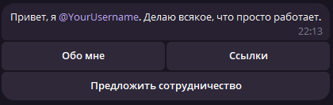

# tg-profile-bot



Telegram бот-портфолио с панелью администратора. Работает на [Cloudflare Workers](https://workers.cloudflare.com/) + [grammY](https://grammy.dev/).

## Возможности

- Главное меню с навигацией через инлайн-кнопки
- Разделы: "Обо мне", "Проекты", "Ссылки"
- Форма для предложений/сотрудничества с кулдауном 5 минут
- Прямой ответ пользователю через Reply прямо в Telegram

### Панель администратора
- `/stats` - количество пользователей бота
- `/send` - рассылка с полным сохранением форматирования (жирный, моно, картинки и т.д.)
- `/ban <ID>` - заблокировать пользователя
- `/unban <ID>` - разблокировать пользователя

## Установка

### 1. Клонируй репозиторий

```bash
git clone https://github.com/KreziBro/tg-profile-bot
cd tg-profile-bot
npm install
```

### 2. Создай KV namespace для хранения сессий

```bash
npx wrangler kv namespace create BOT_SESSIONS
```

Скопируй `id` из вывода команды и вставь в `wrangler.toml`:

```toml
[[kv_namespaces]]
binding = "BOT_SESSIONS"
id = "ВАШ_ID"
```

### 3. Настрой бота

В файле `src/index.ts` замени:
- `ADMIN_ID` - твой Telegram ID (узнать можно через [@userinfobot](https://t.me/userinfobot))
- `mainText` - текст приветственного сообщения
- Кнопки в `projectsMenu` и `linksMenu` - свои проекты и ссылки

### 4. Загрузи токен бота

```bash
npx wrangler secret put BOT_TOKEN
```

### 5. Задеплой

```bash
npx wrangler deploy
```

### 6. Привяжи Webhook

Вставь в браузер (подставив свои данные):

```
https://api.telegram.org/bot<ТОКЕН>/setWebhook?url=<URL_ИЗ_ДЕПЛОЯ>
```

## Стек

- [Cloudflare Workers](https://workers.cloudflare.com/) - хостинг (бесплатный тариф: 100k запросов/день)
- [Cloudflare KV](https://developers.cloudflare.com/kv/) - хранилище сессий
- [grammY](https://grammy.dev/) - фреймворк для Telegram ботов
- TypeScript
